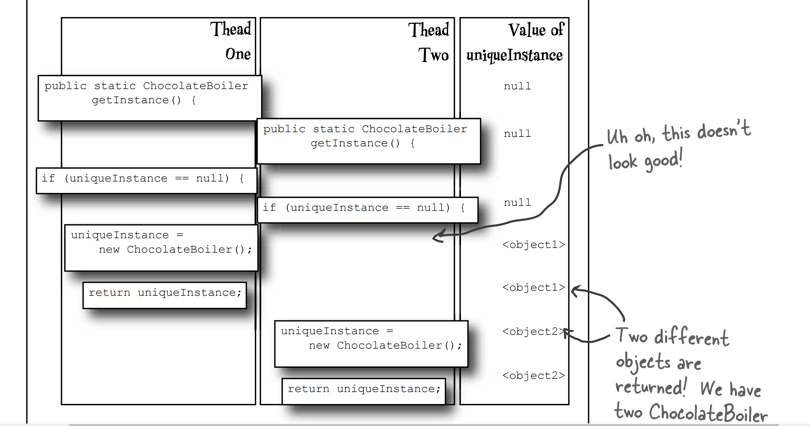

## Chapter 4: Singleton Pattern 单件模式

</br>

## 1. Definition

</br>

单件模式(Singleton Pattern)确保每一个类(Class)只有一个实例(Instance), 并提供一个全局访问点(global point of access)。

</br>

### 1.1 A Simple Example

</br>

```Java
public class Singleton {
    private static Singleton uniqueInstance;
    
    private Singleton(){}
    
    public static Singleton getInstance() {
        if (uniqueInstance == null) {
            uniqueInstance = new Singleton();
        }
        return uniqueInstance;
    } 
}
```

## 2.Why Using it

</br>

### 2.1 Without Singleton Pattern

</br>

多个Object可能会造成Reference混乱。


</br>

### 2.2 With Singleton Pattern

</br>

单件模式保证只有一个instance存在。许多时候整个系统只需要拥有一个的全局对象(Global Object)，这样有利于我们协调系统整体的行为。


一个class能return object一个reference(永远是同一个)和一个获得该instance的方法（必须是static方法，通常使用getInstance这个名称）；当我们调用这个方法时，如果class持有的reference不为空就return这个reference，如果class保持的reference为空就创建该instance of the class并将instance的reference赋予这个class保持的reference.同时我们还将该class的constructor定义为static，这样其他处的代码就无法通过调用该class的constructor来实例化该the object of the class，只有通过这个class提供的static方法来得到该class的唯一instance.

（一个类能返回对象一个引用(永远是同一个)和一个获得该实例的方法。必须是静态方法，通常使用getInstance这个名称。当我们调用这个方法时，如果类持有的引用不为空就返回这个引用，如果类保持的引用为空就创建该类的实例并将实例的引用赋予该类保持的引用；同时我们 还将该类的构造函数定义为私有方法，这样其他处的代码就无法通过调用该类的构造函数来实例化该类的对象，只有通过该类提供的静态方法来得到该类的唯一实例）


</br>

## 3. Singleton Pattern Under Multithreading

</br>

要小心Multithreading的情况下，可能会产生多个objects.



</br>

### 3.1 How to resolve it

</br>

通过加上 synchronized，每个线程在进入这个方法前需要等别的线程离开。不会有两个线程同时进入。但是因为每次都会 synchronize，会拖垮性能。

```Java
public class Singleton {
 private static Singleton uniqueInstance;
 // other useful instance variables here
 private Singleton() {}
 public static synchronized Singleton getInstance() {
 if (uniqueInstance == null) {
 uniqueInstance = new Singleton();
 }
 return uniqueInstance;
 }
 // other useful methods here
}
```